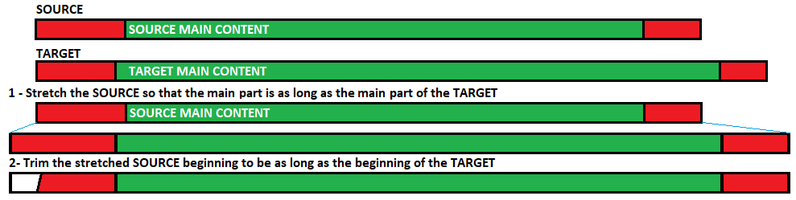
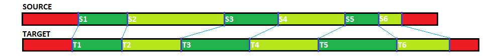

# video-audio-track-sync

Scripts that stretch and trim the audio of a source video to match the duration of a target video.

A common use case is adapting the audio from a video in one language to the same video in another language which has higher quality visuals and may include additional scenes that are missing in the first language version.

## What It Does

- Takes a source video and a target video.
- Shows the user images corresponding to scene changes.
- The user selects two pairs of images that correspond between the videos (start and end).
- Stretches and trims the source video's audio to fit the target video.

## Scripts

There are two versions of the script based on your needs:

### `video_audio_track_sync_scenes_fixed_speed`

- Takes start and end pairs of corresponding scenes.
- Stretches the audio at a fixed speed based on the ratio of the durations between the provided points.
- Trims or extend the beginning of the source audio to fill the initial part of the target video up to the indicated start match.

This version is simpler and faster, suitable when the two videos correspond perfectly but have different durations, so no missing scenes in either video.



```
usage: video_audio_track_sync_scenes_fixed_speed.exe [-h] [-sp SOURCE_PATH] [-tp TARGET_PATH] [-efsm EDGES_FRAME_SEARCH_MINUTES] [-fdp FRAME_DIFF_PERCENTAGE] [-ff FFMPEG]

Adjusts audio duration based on 2 safe frame pairs of videos

options:
  -h, --help            show this help message and exit
  -sp SOURCE_PATH, --source-path SOURCE_PATH
                        viddeo with wrong timing
  -tp TARGET_PATH, --target-path TARGET_PATH
                        video with right timing
  -efsm EDGES_FRAME_SEARCH_MINUTES, --edges-frame-search-minutes EDGES_FRAME_SEARCH_MINUTES
                        number of minutes at the beginning and end of videos to search for scene changes
  -fdp FRAME_DIFF_PERCENTAGE, --frame-diff-percentage FRAME_DIFF_PERCENTAGE
                        difference between frames to start a new scene
  -ff FFMPEG, --ffmpeg FFMPEG
                        ffmpeg binary path
```

### `video_audio_track_sync_scenes_dynamic_speed`

- Detects scene changes and identifies common scenes.
- Calculates duration differences of individual scenes between the two videos.
- Adapts the audio to account for missing scenes within certain limits.

This advanced version is ideal for videos with dynamic speeds or missing parts, ensuring precise synchronization even with varying scene durations.



```
usage: video_audio_track_sync_scenes_dynamic_speed.exe [-h] [-sp SOURCE_PATH] [-tp TARGET_PATH] [-scb] [-tcb] [-fdp FRAME_DIFF_PERCENTAGE] [-ff FFMPEG] [-rb RUBBERBAND] [-im IMAGEMAGICK]

Adjusts audio duration based on 2 safe frame pairs of videos

options:
  -h, --help            show this help message and exit
  -sp SOURCE_PATH, --source-path SOURCE_PATH
                        video with wrong timing
  -tp TARGET_PATH, --target-path TARGET_PATH
                        video with right timing
  -scb, --source-cut-borders
                        need to remove black borders from source frames
  -tcb, --target-cut-borders
                        need to remove black borders from target frames
  -fdp FRAME_DIFF_PERCENTAGE, --frame-diff-percentage FRAME_DIFF_PERCENTAGE
                        difference between frames to start a new scene
  -ff FFMPEG, --ffmpeg FFMPEG
                        ffmpeg binary path
  -rb RUBBERBAND, --rubberband RUBBERBAND
                        rubberband binary path
  -im IMAGEMAGICK, --imagemagick IMAGEMAGICK
                        magick binary path
```

### `video_subs_track_sync_scenes_dynamic_speed`

This script is almost identical to `video_audio_track_sync_scenes_dynamic_speed`, but it synchronizes subtitles instead of audio.

```
usage: video_subs_track_sync_scenes_dynamic_speed.py [-h] [-sp SOURCE_PATH] [-tp TARGET_PATH] [-ssp SOURCE_SUB_PATH] [-fdp FRAME_DIFF_PERCENTAGE] [-ff FFMPEG]

Adjusts audio duration based on 2 safe frame pairs of videos

options:
  -h, --help            show this help message and exit
  -sp SOURCE_PATH, --source-path SOURCE_PATH
                        video with wrong timing
  -tp TARGET_PATH, --target-path TARGET_PATH
                        video with right timing
  -ssp SOURCE_SUB_PATH, --source-sub-path SOURCE_SUB_PATH
                        sub with wrong timing
  -fdp FRAME_DIFF_PERCENTAGE, --frame-diff-percentage FRAME_DIFF_PERCENTAGE
                        difference between frames to start a new scene
  -ff FFMPEG, --ffmpeg FFMPEG
                        ffmpeg binary path
```

## Required Software

- **[ffmpeg](https://ffmpeg.org/) (mandatory)**: Used to extract scene changes, get video information (fps, ticks per second, audio frequency, duration), and perform audio conversions.
- **[rubberband](https://breakfastquay.com/rubberband/) (mandatory for dynamic_speed audio script)**: Used for applying dynamic speed changes to audio accurately.
- **[imagemagick](https://imagemagick.org/) (optional for dynamic_speed script)**: Used to remove black bars from the sides of videos if present.
